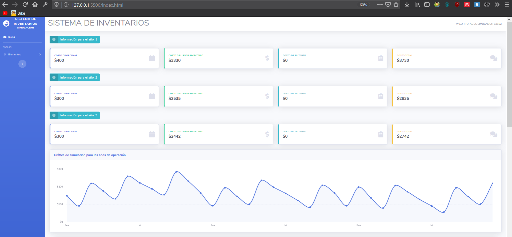
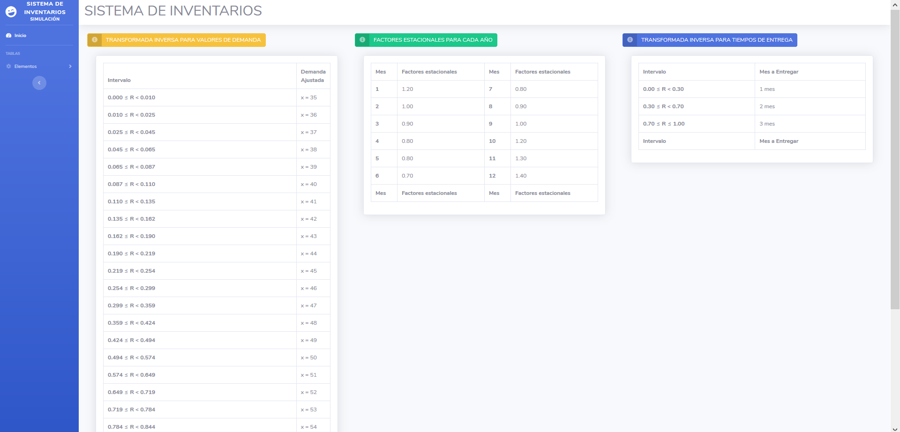

# [SISTEMA DE INVENTARIOS](https://github.com/JackAndrewG/Sistema-Inventarios/tree/master)

[Sistema de Inventarios](https://github.com/JackAndrewG/Sistema-Inventarios/tree/master) es una sistema para el curso de Simulación de la[Universidad Nacional de Loja](https://unl.edu.ec/) creado por estudiantes de 6to ciclo Karla Jiménez, [Jackson Guzmán](https://github.com/JackAndrewG), Albert Mora.

## Vista Previa

## Transformada Inversa

Copyright 2020-2021 Blackrock Digital LLC. Code released under the license.
